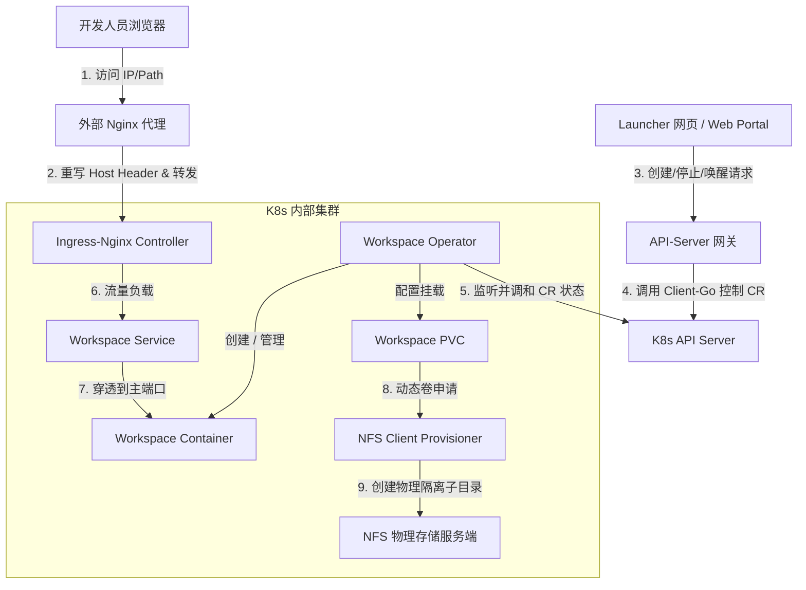

# Agent Workspace 部署架构设计与组件作用解析

本项目基于 Kubernetes 构建了一套面向企业/团队的**动态开发工作空间（Workspace On Demand）**托管平台。系统通过 API-Server 网关和 Operator 控制器，实现了开发环境的一键拉起、资源限额与会话超时休眠。

以下是系统的整体部署架构设计以及各核心组件在其中扮演的角色与协同工作原理。

---

## 1. 整体架构与流量拓扑

系统各组件的协同关系与请求流量流向如下：



---

## 2. 核心组件作用与职责解析

整个部署方案由 **CRD 与 Operator**、**Ingress**、**NFS 动态存储** 以及 **API-Server** 四大板块构成，它们各司其职，紧密配合：

### 🧬 (1) CRD (自定义资源) 与 Workspace Operator
* **组件构成**：自定义资源声明 `workspaces.ai.example.com`（CRD）与后台控制器 `controller-manager`（Operator）。
* **核心作用**：**整个工作空间生命周期的“大脑”与执行引擎。**
* **具体职责**：
  * **资源状态监听**：不断轮询监听 K8s 集群中 Workspace 实例的创建、修改和删除事件。
  * **子资源编排（一键拉起）**：根据 Workspace 的声明规格，自动创建并管理对应的 `PersistentVolumeClaim`（持久化卷）、`Deployment`（计算负载）、`Service`（内网暴露）和 `Ingress`（外部路由），并建立 **Owner Reference（所有者引用）** 确保级联删除。
  * **会话超时自动休眠（`idleTimeout`）**：以 `Status.LastActiveTime` 为起点计时（创建/API 唤醒/从非 Running 进入 Running 时更新），**不是**根据 Ingress 实时流量判断“是否有人在用”。超过 `idleTimeout` 后 Operator 将 Deployment 副本缩至 `0`，状态为 `Sleeping`。唤醒需通过 API（更新 `lastActiveTime`）或将 `stopped` 置回 false 后由控制器拉起。
  * **副本管理**：Deployment 的 `replicas` 始终由 Operator 根据 `stopped` / `idleTimeout` 写入，无需额外扩缩容组件。

### 🌐 (2) Ingress (网关路由层)
* **组件构成**：`ingress-nginx-controller`（基于 Nginx 的 Kubernetes 官方网关控制器）。
* **核心作用**：**南北向流量入口与二级域名路由转发。**
* **具体职责**：
  * **端口绑定与网络透传**：在物理节点上通过 `hostNetwork: true` 模式运行，直接监听集群物理机的 `80` 和 `443` 端口，实现高性能的流量接入。
  * **动态域名解析**：当 Operator 决定启动一个工作空间时，会为其自动创建一个 Ingress 路由规则。Ingress 监听请求的 `Host` 头（如 `ws-dev-user01.bocomcode`），根据域名将流量精确分发到对应用户的 `Service` 上。
  * **长连接（WebSocket）支持**：为开发环境的网页终端（Terminal）、代码热编译等提供持久的、低延迟的 WebSockets 双向通道代理。

### 💾 (3) NFS 动态卷分配器 (`nfs-client-provisioner`)
* **组件构成**：NFS 物理存储器、Kubernetes NFS 驱动插件及 StorageClass。
* **核心作用**：**数据持久化与多用户存储物理隔离。**
* **具体职责**：
  * **存储动态供给（Dynamic Provisioning）**：开发人员通过 API 创建工作空间时，无需手动预先创建存储盘。NFS 驱动会自动检测到 PVC 申请，并在 NFS 共享的根目录（`/`）下实时创建一个**以命名空间、用户和卷名命名的独立子文件夹**。
  * **工作现场持久化**：开发人员在容器内 `/workspace`（代码区）和 `/data`（数据与配置缓存区）中写入的任何文件、会话日志、插件配置或 LLM 聊天记录，都实时写入 NFS。
  * **无损休眠与重启**：当工作空间因闲置被 Operator 缩容至 0（休眠）或因故障漂移到其他节点重启时，计算资源虽然被销毁重建，但 NFS 持久卷数据不受任何影响。新 Pod 启动时只需重新挂载该目录，开发现场便能 100% 瞬间恢复。

### 🔌 (4) API-Server (轻量级网关)
* **组件构成**：一个独立编译部署 of Go Web 服务，挂载了专用的 ServiceAccount `api-server-sa`。
* **核心作用**：**前端 Portal 与 Kubernetes 底层集群之间的通信桥梁。**
* **具体职责**：
  * **屏蔽集群复杂度**：对外（面向网页 Launcher 或三方平台）提供简洁 of HTTP RESTful 接口（创建、唤醒、停止、查询状态），避免外部系统直接使用复杂的 Kubernetes 证书和 SDK。
  * **用户身份与参数映射**：接收 HTTP 请求中的自定义参数（如自定义镜像、环境变量、挂载路径 `volumeMounts`、容器入口 `command`、容器后置脚本 `postStartScript` 以及调度命名空间 `namespace`），并在校验后组装成标准的 K8s CR 结构体提交给集群。
  * **状态轮询与阻塞等待**：在拉起或唤醒时，提供阻塞机制（90 秒超时），API-Server 会在后台监听 Pod 是否 Ready，并在容器完全可以提供服务时才向请求端返回成功状态，确保极佳的用户体验。

---

## 3. 组件间的生命周期协同工作流

我们以一个典型的**创建工作空间**过程，展示各组件的协同配合：

```text
 1. 外部请求 -> API-Server (带参数 {"userId": "user1", "namespace": "dev-ns", "port": 1234})
 2. API-Server -> 在 K8s 对应命名空间创建名为 "ws-user1" 的 Workspace 自定义对象
 3. Operator (监听到事件) -> 开始调和：
    a. 向 NFS StorageClass 发起 1Gi 的 PVC 申请
    b. NFS-Provisioner 在 NFS 磁盘上生成文件夹 `/dev-ns-ws-user1-pvc-xxx` 并绑定
    c. Operator 创建 Deployment (注入用户指定的镜像、端口 1234、挂载参数及 postStart 脚本)
    d. Operator 创建 Service (暴露 Deployment 的 http 端口)
    e. Operator 创建 Ingress (绑定域名 ws-user1.bocomcode，指向 Service 80 端口)
 4. Pod 启动成功 -> 运行后置脚本 (postStartScript) -> 容器服务就绪 (处于 Running)
 5. Ingress Controller 刷新配置 -> 将 http://ws-user1.bocomcode 接入后端 Pod
 6. API-Server 轮询检测到 Workspace 状态变为 Running -> 向外部返回 "http://ws-user1.bocomcode" 访问入口
 7. 开发人员通过配置了 Cookie 转发的外部 Nginx 访问 IP/bocomwork/ws/user1/ -> 开始愉快编码
```
